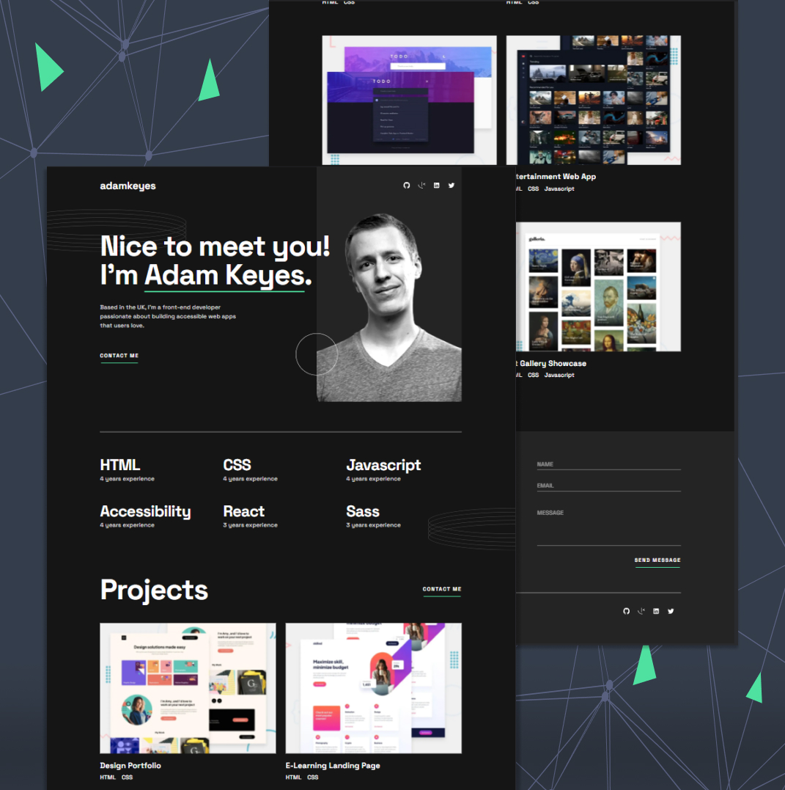

# Frontend Mentor - Single-page developer portfolio solution



## Table of contents

- [Overview](#overview)
  - [The challenge](#the-challenge)
  - [Links](#links)
- [My process](#my-process)
  - [Built with](#built-with)
  - [What I learned](#what-i-learned)
  - [Continued development](#continued-development)
  - [Useful resources](#useful-resources)
- [Author](#author)

## Overview

### The challenge

Users should be able to:

- Receive an error message when the `form` is submitted if:
  - Any field is empty
  - The email address is not formatted correctly
- View the optimal layout for the interface depending on their device's screen size
- See hover and focus states for all interactive elements on the page

### Links

- [View live site](https://developer-portfolio-vert.vercel.app/)

## My process

### Built with

- Semantic HTML5 markup
- Material UI
- Mobile-first workflow
- [React](https://reactjs.org/) - JS library
- [Next.js](https://nextjs.org/) - React framework
- [Material UI](https://mui.com/) - UI components library

### What I learned

One very simple thing I learned in this project was how to add smooth scrolling to a specific section of your page, like followes:

```html
<html style={{ scrollBehavior: 'smooth' }}>...</html>
```

I also had to google down how to customize the palette MUI comes predefined with. What I ended up doing was:

```ts
declare module '@mui/material/styles/createPalette' {
  export interface Palette {
    neutral: {
      main: string
      dark: string
    }
  }

  export interface PaletteOptions {
    neutral: {
      main: string
      dark: string
    }
  }
}
```

And to add custom breakpoints:

```ts
declare module '@mui/material/styles' {
  interface BreakpointOverrides {
    xs: true
    sm: true
    tablet: true
    md: true
    lg: true
    desktop: true
    xl: true
    tv: true
  }
}
```

### Continued development

Since I had to create a complex button for this site, in future projects I will be exploring more of Material UI to get more comfortable in creating more unique UI components.

### Useful resources

- [Next.js docs](https://nextjs.org/docs) - Followed the documentation throughout the whole process to find out the recommended way to start & deploy the project.
- [Smooth scroll in Next.js](https://stackoverflow.com/questions/69825670/smooth-scroll-in-next-js) - This question in Stackoverflow helped to figure out how to add smooth scrolling to the `Contact` section.
- [MUI complex button](https://mui.com/material-ui/react-button/#complex-button) - Used this as a base to create the buttons on the `Projects` section.

## Author

- Frontend Mentor - [@hamilton-i7](https://www.frontendmentor.io/profile/hamilton-i7)
- Twitter - [@hamilton_i7](https://twitter.com/hamilton_i7)
- LinkedIn - [Juan Hamilton Edwards](https://www.linkedin.com/in/juan-hamilton-edwards/)
